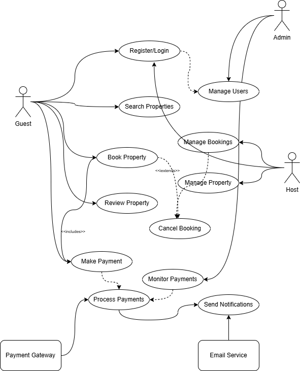

## 🗂️ Diagram Overview

The diagram captures the main user interactions with the backend and the relationships between the **Guest**, **Host**, **Admin**, and external systems like **Payment Gateway** and **Email Service**.

---

## 👥 Actors and Their Roles

| Actor | Description |
|--------|--------------|
| **Guest** | A customer who searches for properties, makes bookings, payments, and leaves reviews. |
| **Host** | A user who lists and manages properties, monitors bookings, and handles cancellations. |
| **Admin** | An administrator who manages users, monitors payments, and oversees the platform’s health. |
| **Payment Gateway** | External service (e.g., Stripe/PayPal) responsible for securely processing payments. |
| **Email Service** | External service (e.g., SendGrid/Mailgun) that sends notifications like confirmations and updates. |

---

## ⚙️ Key Use Cases and Interactions

### 1. **User Authentication**
- **Actors:** Guest, Admin  
- **Use Cases:** `Register/Login`, `Manage Users`  
- **Description:**  
  Guests and admins authenticate into the system. Admins can manage user roles and deactivate accounts if needed.

---

### 2. **Property Management**
- **Actors:** Host  
- **Use Cases:** `Manage Property`, `Manage Bookings`  
- **Description:**  
  Hosts can add, update, or remove property listings. They can also approve or reject booking requests.

---

### 3. **Search and Booking**
- **Actors:** Guest  
- **Use Cases:** `Search Properties`, `Book Property`, `Cancel Booking`  
- **Relationships:**  
  - `Book Property` **extends** `Cancel Booking` (optional flow)  
- **Description:**  
  Guests can search for listings using filters (location, price, amenities) and make or cancel bookings.

---

### 4. **Payments**
- **Actors:** Guest, Host, Payment Gateway, Admin  
- **Use Cases:** `Make Payment`, `Process Payments`, `Monitor Payments`  
- **Relationships:**  
  - `Book Property` **includes** `Make Payment`  
- **Description:**  
  Guests make payments through the integrated payment gateway. Admins can track and monitor all transactions.

---

### 5. **Reviews**
- **Actors:** Guest  
- **Use Cases:** `Review Property`  
- **Description:**  
  After completing a booking, guests can submit reviews and ratings for hosts and properties.

---

### 6. **Notifications**
- **Actors:** Email Service  
- **Use Cases:** `Send Notifications`  
- **Description:**  
  The system triggers notifications for booking confirmations, cancellations, or payment receipts, handled by an external email service.

---

## 🔗 Relationships Between Use Cases

| Relationship | Description |
|---------------|-------------|
| **<<include">>** | A mandatory sub-process. Example: `Book Property` includes `Make Payment`. |
| **<<extend">>** | An optional process. Example: `Book Property` may extend to `Cancel Booking`. |

---

## 🧠 Summary
This **Use Case Diagram** represents the backbone of the Airbnb Clone backend system, showing:
- How users and services interact.
- What functionalities each actor can perform.
- How internal and external systems collaborate.

It serves as a blueprint for **API design**, **database relationships**, and **user journey mapping** in subsequent development stages.

---
